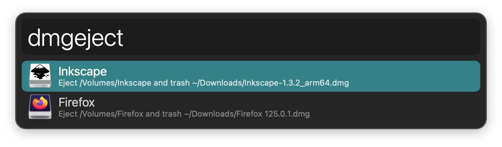

#  Purge Disk Images Alfred Workflow

Find, Unmount, and Trash DMGs

[⤓ Install on the Alfred Gallery](https://alfred.app/workflows/alfredapp/purge-disk-images)

## Usage

See mounted disk images via the `dmgeject` keyword. <kbd>↩&#xFE0E;</kbd> to eject it and trash the DMG.

Find DMG files via the `dmgtrash` keyword. <kbd>↩&#xFE0E;</kbd> to trash the DMG.

In both cases, Alfred’s list refreshes if more results remain after trashing one or hides when trashing the last one.
